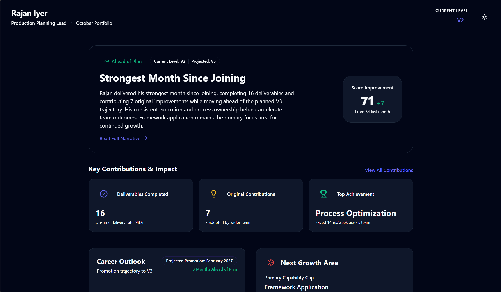
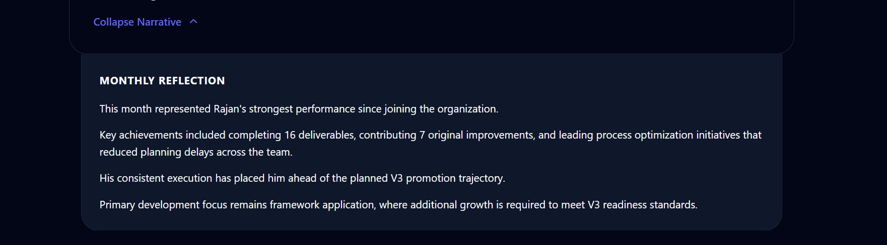
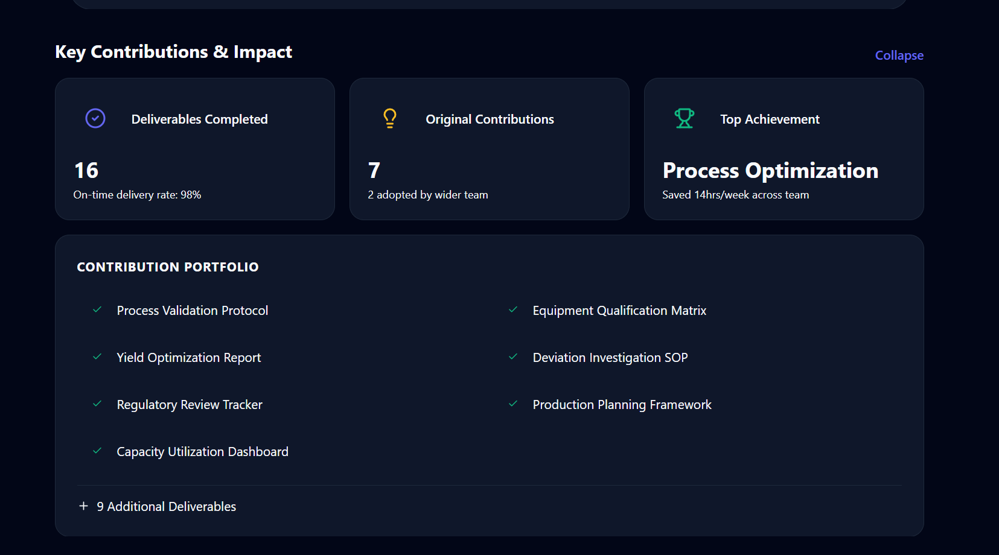
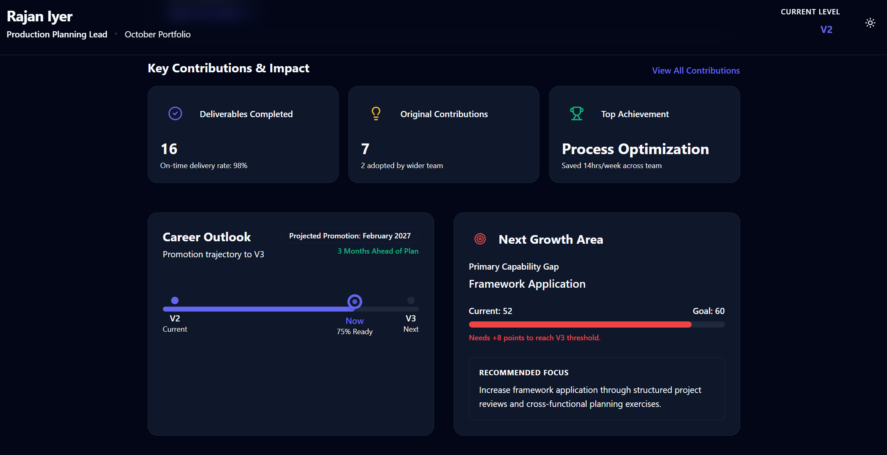
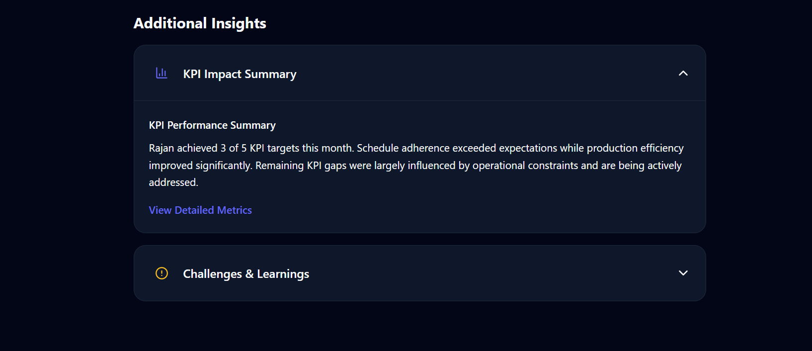
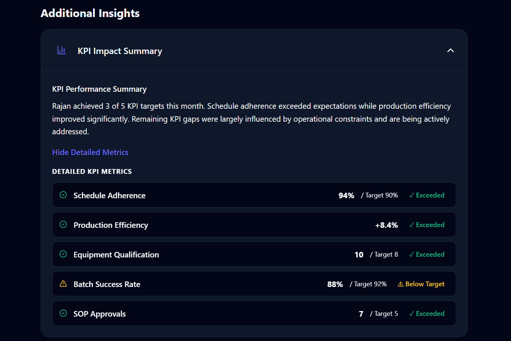
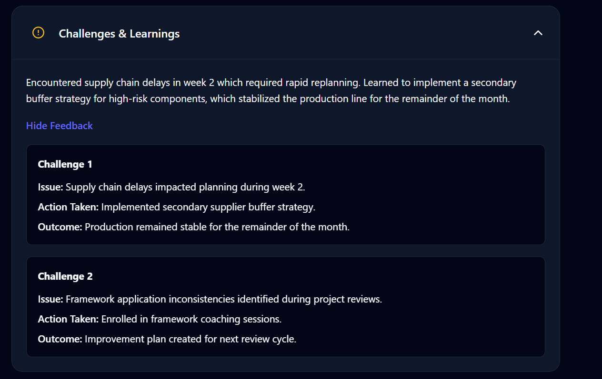
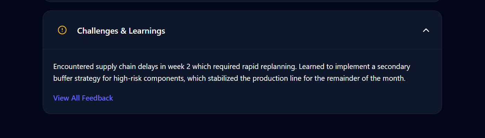
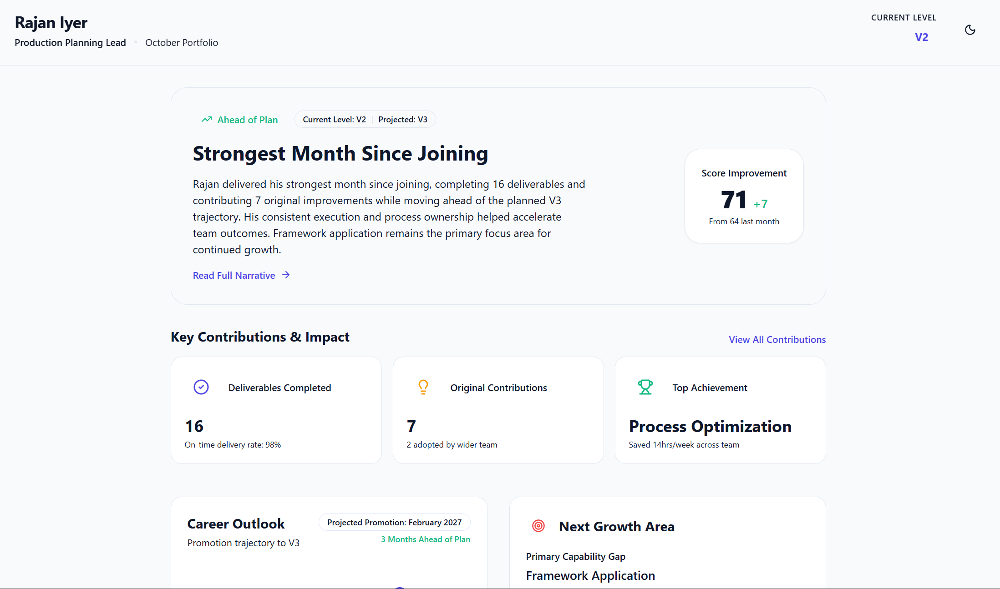

# Leadership Portfolio Redesign

**DT CultureTech — Product Management Assignment**

A redesign of the Leadership Portfolio page from a metric-heavy operational dashboard into a narrative-driven career-growth artifact that helps employees understand their progress, impact, and trajectory.

---

## 📋 Table of Contents

- [Problem Statement](#problem-statement)
- [User Analysis](#user-analysis)
- [Design Goals](#design-goals)
- [Information Hierarchy](#information-hierarchy)
- [Portfolio Structure](#portfolio-structure)
- [Key Design Decisions](#key-design-decisions)
- [Progressive Disclosure](#progressive-disclosure)
- [Design Process](#design-process)
- [Screenshots](#screenshots)
- [Tech Stack](#tech-stack)
- [Running Locally](#running-locally)
- [Documentation](#documentation)
- [Conclusion](#conclusion)

---

## Problem Statement

The original Leadership Portfolio presented employee performance data as a collection of isolated metrics, KPI tables, and operational scores. While accurate, this format created several problems:

- Employees could not understand whether they were improving or declining.
- There was no connection between individual contributions and career progression.
- Promotion readiness was not visible or actionable.
- KPI data dominated the experience, making the page feel like a manager's dashboard rather than an employee's growth artifact.
- There was no narrative to tie metrics together into a coherent story.

**The core challenge:** Transform a data display into a career-growth story.

---

## User Analysis

### Primary User: Employee
- Reviews the portfolio monthly to understand personal growth.
- Needs clarity on trajectory, not just scores.
- Wants to know what to improve next, not just where they fell short.

### Secondary Users

| User | Need |
|------|------|
| **Mentor** | Uses the portfolio as a discussion artifact during 1:1s. Needs visible contributions and growth areas. |
| **Supervisor** | Evaluates promotion readiness. Needs trajectory and evidence in a scannable format. |
| **HR** | Reviews portfolios across employees. Needs consistent structure and objective progression data. |

---

## Design Goals

The redesigned portfolio answers five core questions for the employee:

| # | Question | Section |
|---|----------|---------|
| 1 | Am I improving? | Hero Section — Growth Status & Score Improvement |
| 2 | What caused my improvement? | Key Contributions & Impact |
| 3 | Where am I headed? | Career Outlook |
| 4 | What should I improve next? | Next Growth Area |
| 5 | What evidence supports this story? | Additional Insights (Progressive Disclosure) |

---

## Information Hierarchy

The portfolio follows a deliberate top-to-bottom narrative flow:

```
Growth          →  "Am I improving?"
  ↓
Impact          →  "What caused my improvement?"
  ↓
Future          →  "Where am I headed?"
  ↓
Improvement     →  "What should I improve next?"
  ↓
Supporting      →  "What evidence supports this story?"
Details
```

---

## Portfolio Structure

### 1. Employee Header
Employee name, role, reporting month, and current level. Includes a light/dark mode toggle.

### 2. Strongest Month Since Joining (Hero Section)
A narrative-first hero card showing growth status ("Ahead of Plan"), current/projected level context, a written summary of the month's performance, and score improvement. Expandable into a full Monthly Reflection.

### 3. Key Contributions & Impact
Three metric cards — Deliverables Completed, Original Contributions, and Top Achievement — with expandable access to the full Contribution Portfolio.

### 4. Career Outlook
Visual V2 → V3 progression track with projected promotion date (February 2027) and months ahead of plan.

### 5. Next Growth Area
Primary capability gap (Framework Application) with a progress bar, explicit point gap, and an actionable Recommended Focus section.

### 6. Additional Insights
Collapsible accordion sections for KPI Impact Summary and Challenges & Learnings, each with nested progressive disclosure into detailed metrics and structured feedback.

---

## Key Design Decisions

| Decision | Rationale |
|----------|-----------|
| **Growth-focused hero** instead of score-focused dashboard | Employees should first understand their growth status, not parse raw numbers. |
| **Contributions remain visible** | They serve as career evidence and discussion points during mentor/supervisor reviews. |
| **Career Outlook before Growth Area** | Users should understand the destination before evaluating what's required to get there. |
| **KPI details collapsed** behind progressive disclosure | Operational data supports the story but should not dominate the employee experience. |
| **Constraints reframed as Challenges & Learnings** | Encourages reflection and growth mindset rather than highlighting failures. |
| **Narrative over metrics** | The overall experience reads as a career portfolio, not a business report. |

---

## Progressive Disclosure

All supporting details are accessible on demand through expandable sections:

| Action | Reveals |
|--------|---------|
| Read Full Narrative | Monthly Reflection with detailed performance summary |
| View All Contributions | Full Contribution Portfolio with 7 named items + 9 additional |
| View Detailed Metrics | 5 KPI rows with targets, values, and status indicators |
| View All Feedback | 2 structured challenges with Issue, Action, and Outcome |

---

## Design Process

The redesign followed a structured, first-principles design process documented across a **13-page hand-drawn design document** ([view PDF](screenshots/00-wireframe-hand-drawn.pdf)):

1. **User Analysis** — Identified primary/secondary users and defined the core design principle: *"Design like a pitch deck, not a dashboard."*
2. **Problem Framing** — Established the transformation goal (Metric → Story) and audited existing sections for relevance.
3. **Hierarchy Exploration** — Built candidate information hierarchies and compared ordering options.
4. **Ordering Decision** — Evaluated two competing flows and selected Career Outlook before Growth Area, with typed rationale.
5. **Sample Data Mapping** — Applied the hierarchy to real user data (Rajan Iyer) to validate the narrative.
6. **Wireframe Construction** — Drew the final card-by-card layout with annotations explaining each placement decision.
7. **Design Decision Documentation** — Captured three core design decisions with reasoning.
8. **Reading Flow** — Confirmed the final hierarchy: Growth → Impact → Future → Improvement → Supporting Details.

---

## Screenshots

### Full Portfolio View (Dark Mode)


### Monthly Reflection (Expanded)


### Contribution Portfolio (Expanded)


### Career Outlook & Next Growth Area


### Additional Insights (KPI & Challenges — Collapsed)


### KPI Detailed Metrics (Expanded)


### Challenges & Learnings (Expanded)


### Challenges & Learnings (Collapsed)


### Full Portfolio View (Light Mode)


### Design Process Document (Hand-Drawn, 13 Pages)

The complete design thinking process is captured in a 13-page hand-drawn PDF that documents the journey from problem analysis to final wireframe.

> [View Full Design Process PDF](screenshots/00-wireframe-hand-drawn.pdf)

**What the document covers:**

| Pages | Phase | Content |
|-------|-------|--------|
| 1 | User Analysis | Identified primary user (Employee) and secondary users (Supervisor, Mentor, HR). Defined core design principle: *"Design the portfolio like a pitch deck, not a dashboard."* Mapped V1–V5 level taxonomy and defined key terms (KPI, IP, Deliverables, Constraints, Career Runrate). |
| 2 | Problem Framing | Established the core transformation: *Metric → Story*. Defined the primary employee question: *"Am I improving?"* Audited each existing section and decided what to keep, collapse, rename, or reposition. |
| 3 | Initial Hierarchy | Created first-draft information hierarchy: Strongest Month → What Caused Improvement → Career Projection → Main Growth Gap → KPI Summary → Challenges/Constraints. |
| 4 | Ordering Decision | Compared two hierarchy options — (A) Strong Month → Growth Gap → Promotion vs (B) Strong Month → Promotion → Growth Gap — and selected Option B as the better approach. |
| 5 | Ordering Rationale | Typed justification for why Career Outlook precedes Growth Area: *"Employees are more likely to engage with improvement areas when they understand the future outcome attached to them."* |
| 6 | Sample User Data | Documented Rajan Iyer's complete metrics: composite score 71, previous 64, V2→V3 trajectory, 16/20 deliverables, 7 IP contributions, 3/5 KPIs, framework score 52 (threshold 60), 8 constraints raised / 5 resolved. |
| 7 | Data Observations | Identified key observations: strongest month since joining, significant score improvement, ahead of V3 trajectory, framework score as primary blocker, high contribution volume, KPI details as too operational. |
| 7–8 | Final Wireframe | Hand-drawn wireframe starting with Employee Header (name, role, month, level) flowing into Strongest Month hero card with annotations on why each element exists. |
| 8 | Hero → Contributions | Hero section flows to Key Contributions & Impact with annotation: *"First answer the user's biggest question: Am I improving?"* |
| 9 | Career Outlook | Career Outlook card with annotation: *"Shows why this month was successful & provides career evidence."* |
| 10 | Next Growth Area | Growth Area card with annotation: *"Shows future direction."* |
| 11 | Additional Insights | Final wireframe card for KPI Impact Summary and Challenges & Learnings with progressive disclosure brackets. Annotation: *"Supporting information that should not dominate the main narrative."* |
| 11–12 | Design Decisions | Three documented decisions with rationale: (1) Growth-focused hero because employees primarily want to know if they're improving, (2) Contributions remain visible because they act as career evidence, (3) KPI/constraint details collapsed into summaries to reduce cognitive overload while preserving information. |
| 13 | Final Reading Flow | Clean summary of the final information hierarchy: Growth → Impact → Future → Improvement → Supporting Details. |

---

## Tech Stack

| Technology | Purpose |
|------------|---------|
| React | Component-based UI |
| Vite | Development server and build tool |
| Tailwind CSS v3 | Utility-first styling with dark mode support |
| Lucide React | Icon library |

---

## Running Locally

```bash
# Clone the repository
git clone https://github.com/<svg-Adnan>/leadership-portfolio-redesign.git
cd leadership-portfolio-redesign

# Install dependencies
npm install

# Start development server
npm run dev
```

Open [http://localhost:5173](http://localhost:5173) in your browser.

---

## Documentation

| Document | Description |
|----------|-------------|
| [design-rationale.md](docs/design-rationale.md) | Detailed analysis of design decisions, tradeoffs, and justifications |


---

## Conclusion

This redesign transforms the Leadership Portfolio from a metric-display tool into a career-growth artifact. By prioritizing narrative over numbers, organizing information around employee questions rather than data categories, and using progressive disclosure to manage complexity, the portfolio now serves as a personal career document that employees can use to understand their growth, discuss progress with mentors, and prepare for promotion conversations.

The design ensures that every section earns its place by answering a specific employee question, while supporting details remain accessible without cluttering the primary experience.

---

*Submitted as part of the DT CultureTech Product Management assignment.*
