# Design Rationale

**Leadership Portfolio Redesign — DT CultureTech**

This document explains the reasoning behind each major design decision in the Leadership Portfolio redesign.

---

## 1. Problem Analysis

### Original State
The existing Leadership Portfolio functioned as an operational dashboard. It displayed:
- Raw KPI scores in tabular format
- Isolated metrics without context
- Promotion-related data buried in dense layouts
- No narrative connecting performance to growth

### Impact on Users
- **Employees** could see numbers but not interpret them. A score of 71 has no meaning without context — is it good? Is it improving? What caused it?
- **Mentors** had no structured talking points for 1:1s. Contributions were scattered or absent.
- **Supervisors** could not quickly assess promotion readiness without reading through operational data.
- **HR** had no standardized, scannable format to compare across employees.

### Root Cause
The portfolio was designed around *data availability* (what the system can display) rather than *user questions* (what the employee needs to know). The redesign inverts this by structuring every section around a specific question.

---

## 2. User Needs

| User | Primary Question | What They Need |
|------|-----------------|----------------|
| Employee | "Am I on track?" | Clear growth status, trajectory, and next steps |
| Mentor | "What should we discuss?" | Visible contributions and development areas |
| Supervisor | "Is this person promotion-ready?" | Trajectory visualization and evidence |
| HR | "How does this person compare structurally?" | Consistent format with objective data |

The employee is the primary user. Every design decision prioritizes the employee's ability to understand their own growth story. Secondary users benefit from the same structure without requiring a separate view.

---

## 3. Design Process

The design process is fully documented in a **13-page hand-drawn design document** included in the submission. Each phase is summarized below.

### Phase 1: User Analysis (Page 1)

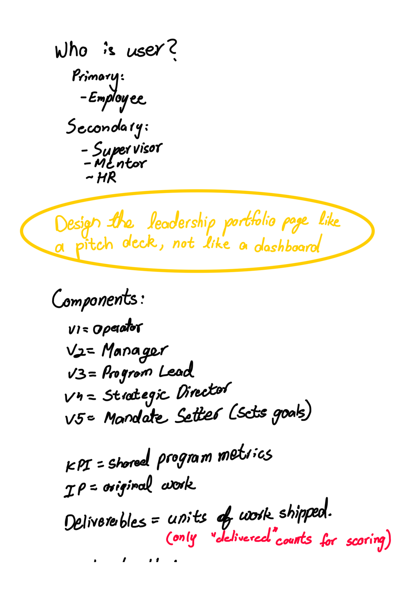

Before touching any layout, the process began by defining who uses the portfolio:
- **Primary user:** Employee reviewing monthly progress
- **Secondary users:** Supervisor, Mentor, HR

The core design principle was established at this stage:
> *"Design the leadership portfolio page like a pitch deck, not like a dashboard."*

The platform's level taxonomy was also mapped (V1 = Operator, V2 = Manager, V3 = Program Lead, V4 = Strategic Director, V5 = Mandate Setter) along with key term definitions — KPIs as shared program metrics, IP as original work, Deliverables as units of work shipped (only "delivered" counts for scoring), Constraints as blockers, and Career Runrate as the career progression score.

### Phase 2: Problem Framing — Metric → Story (Page 2)

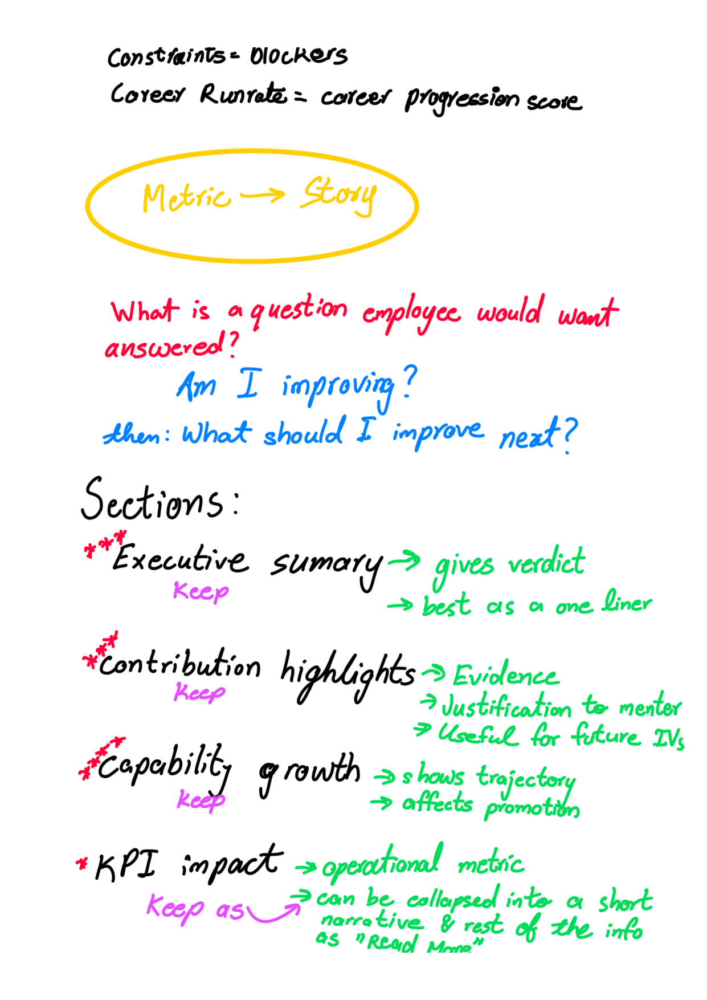

The core transformation was articulated: **Metric → Story**.

The primary employee question was identified: *"Am I improving?"* followed by *"What should I improve next?"*

Each existing section was then audited with a keep/collapse/rename/reposition decision:
- **Executive Summary** → Keep. Gives a verdict. Best as a one-liner.
- **Contribution Highlights** → Keep. Evidence. Justification to mentors. Useful for future interviews.
- **Capability Growth** → Keep. Shows trajectory. Affects promotion.
- **KPI Impact** → Keep as collapsed narrative. Operational metric that can be summarized, with details behind "Read More."
- **Constraint Patterns** → Keep lower down. Somewhat useful. Rename to "Challenges Overcome."
- **Career Trajectory** → Keep. Future-oriented. Very important for growth perspective.

### Phase 3: Hierarchy Exploration (Pages 3–4)

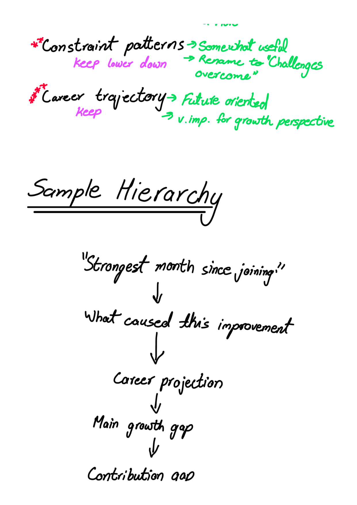
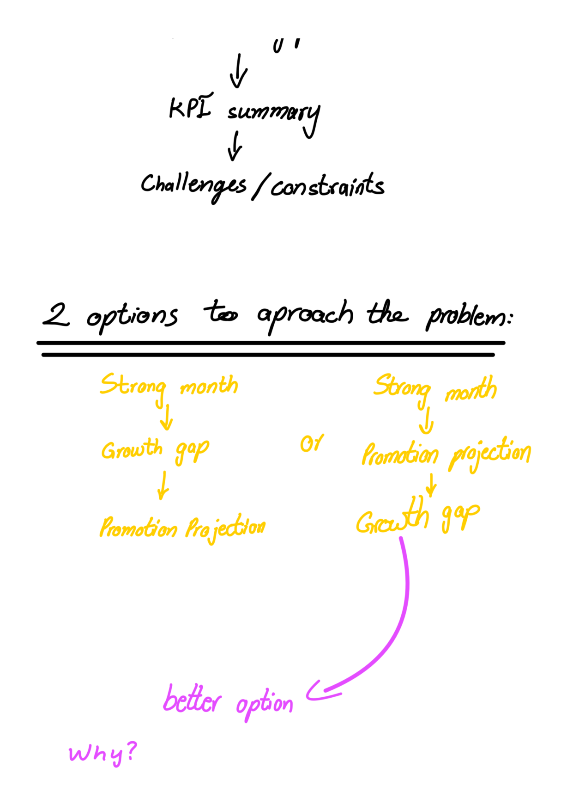


An initial sample hierarchy was drafted:

```
"Strongest Month Since Joining"
  ↓
What caused this improvement
  ↓
Career projection
  ↓
Main growth gap
  ↓
KPI summary
  ↓
Challenges / constraints
```

A critical ordering decision was then explored — **two competing approaches**:

| Option A | Option B |
|----------|----------|
| Strong Month → Growth Gap → Promotion Projection | Strong Month → Promotion Projection → Growth Gap |

**Option B was selected** as the better approach. The reasoning (documented in Page 5 with typed text):

> *"Career projection is shown before growth gaps because the projection provides context for why the gap matters. Employees are more likely to engage with improvement areas when they understand the future outcome attached to them. Showing the gap immediately after the projection transforms it from a criticism into an actionable step."*

This is also annotated on Page 4: *"Leaves a more lasting impact on what should be worked on next."*

### Phase 4: Sample Data Mapping (Pages 6–7)

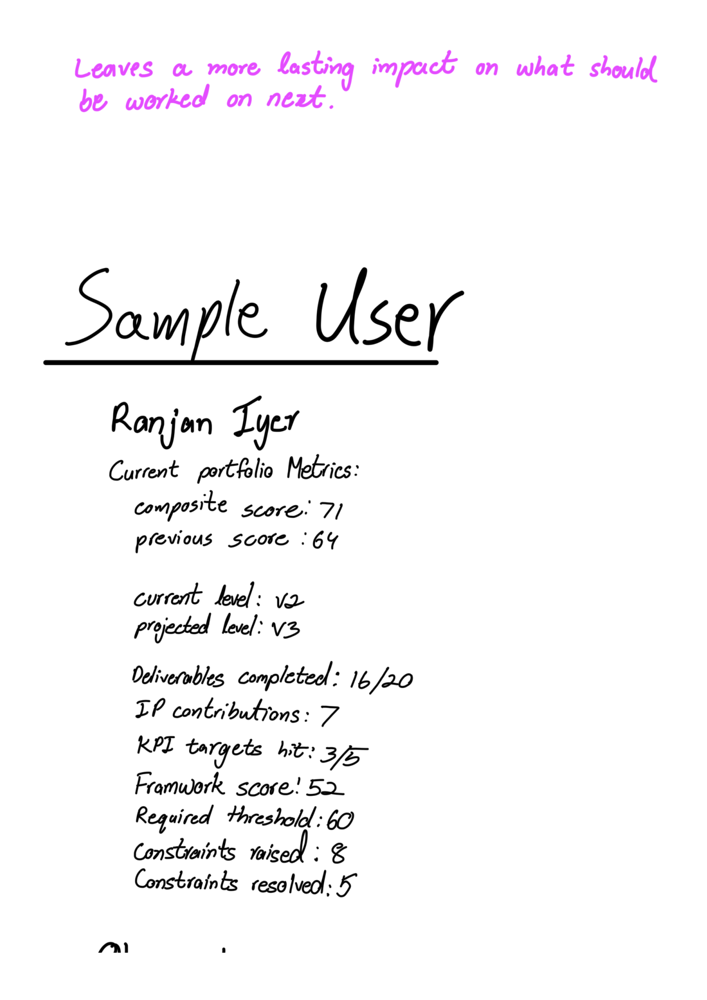
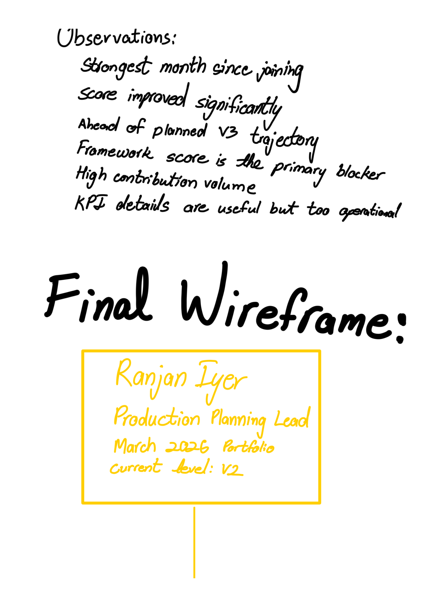

The hierarchy was validated against real user data — Rajan Iyer, Production Planning Lead:

| Metric | Value |
|--------|-------|
| Composite Score | 71 (previous: 64) |
| Current Level | V2 |
| Projected Level | V3 |
| Deliverables | 16/20 completed |
| IP Contributions | 7 |
| KPI Targets Hit | 3/5 |
| Framework Score | 52 (threshold: 60) |
| Constraints Raised | 8 (5 resolved) |

Key observations from this data:
- Strongest month since joining
- Score improved significantly
- Ahead of planned V3 trajectory
- Framework score is the primary blocker
- High contribution volume
- KPI details are useful but too operational

### Phase 5: Wireframe Construction (Pages 7–11)

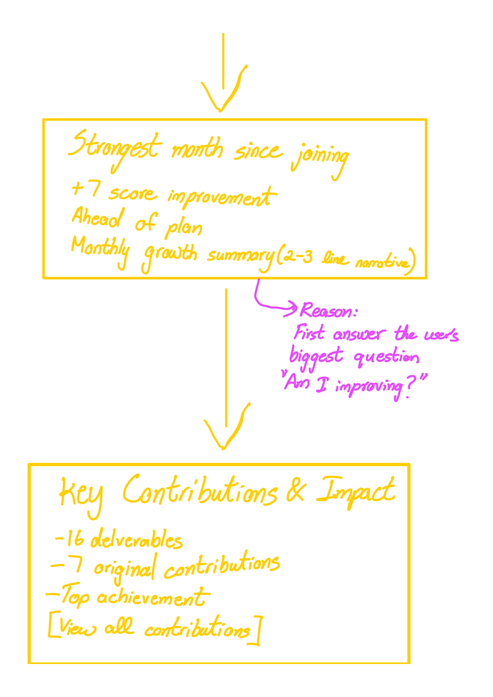
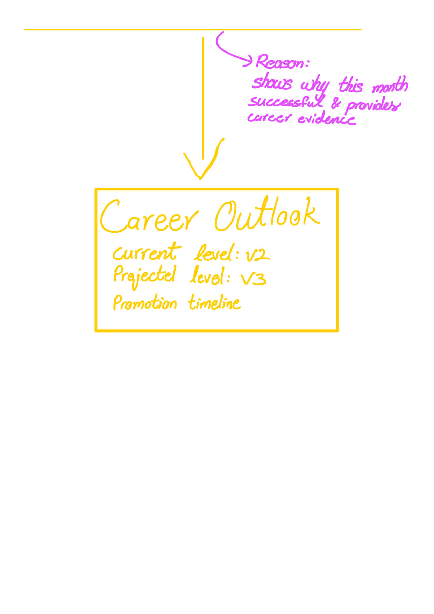
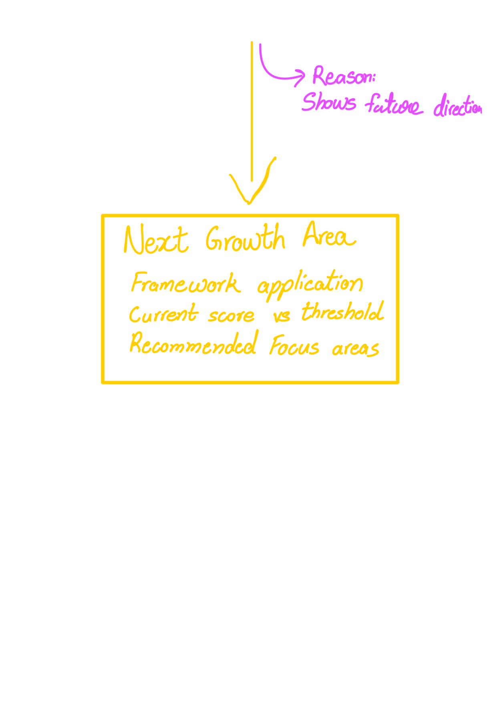
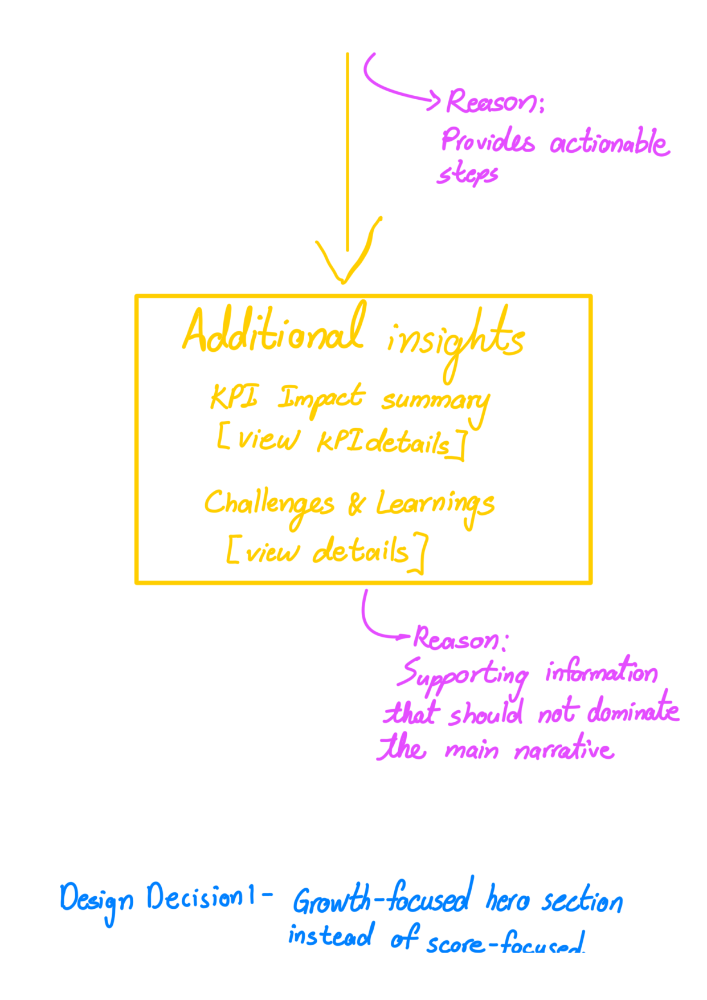

The final wireframe was drawn card-by-card with color-coded annotations explaining placement rationale:

1. **Employee Header** — Name, role, month, current level
2. **Strongest Month Since Joining** — +7 score improvement, Ahead of Plan, 2–3 line narrative. *Annotation: "First answer the user's biggest question: Am I improving?"*
3. **Key Contributions & Impact** — 16 deliverables, 7 original contributions, top achievement, [View All Contributions]. *Annotation: "Shows why this month was successful & provides career evidence."*
4. **Career Outlook** — Current level V2, projected V3, promotion timeline. *Annotation: "Shows future direction."*
5. **Next Growth Area** — Framework Application, current score vs threshold, recommended focus areas. *Annotation: "Provides actionable steps."*
6. **Additional Insights** — KPI Impact Summary [View KPI Details], Challenges & Learnings [View Details]. *Annotation: "Supporting information that should not dominate the main narrative."*

### Phase 6: Design Decision Documentation (Pages 11–12)

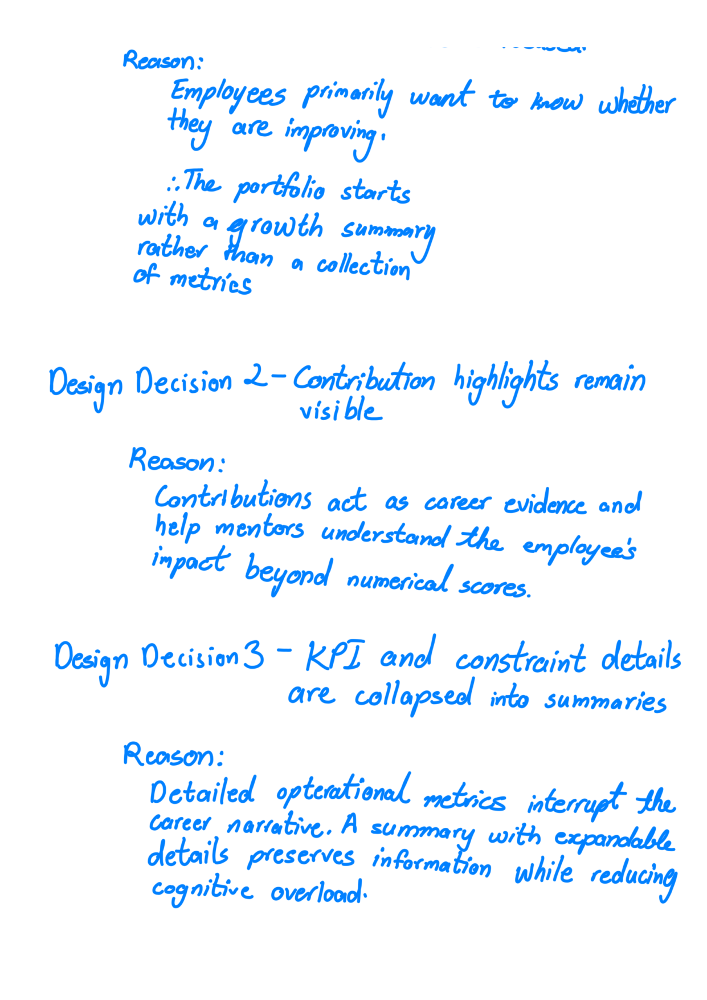

Three formal design decisions were documented with reasoning:

**Decision 1 — Growth-focused hero section instead of score-focused:**
> *"Employees primarily want to know whether they are improving. The portfolio starts with a growth summary rather than a collection of metrics."*

**Decision 2 — Contribution highlights remain visible:**
> *"Contributions act as career evidence and help mentors understand the employee's impact beyond numerical scores."*

**Decision 3 — KPI and constraint details are collapsed into summaries:**
> *"Detailed operational metrics interrupt the career narrative. A summary with expandable details preserves information while reducing cognitive overload."*

### Phase 7: Final Reading Flow (Page 13)

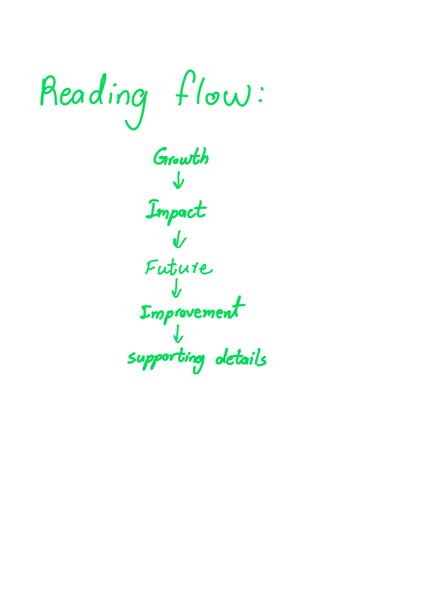

The final confirmed hierarchy:

```
Growth → Impact → Future → Improvement → Supporting Details
```

### Step 8: Build and Iterate
The wireframe was implemented as a functional prototype using React and Tailwind CSS, refined through multiple feedback cycles to ensure content accuracy, interaction completeness, and visual consistency across dark and light modes.

---

## 4. Key Design Decisions & Justifications

### 4.1 Growth-Focused Hero Instead of Score Dashboard

**Decision:** The hero section leads with a growth status label ("Ahead of Plan") and a written narrative, not a score chart.

**Why:** A score of 71 is meaningless in isolation. "Ahead of Plan" immediately tells the employee their relative position. The narrative explains *why* — connecting deliverables, contributions, and execution quality into a coherent story. The score (71, +7) remains visible but is positioned as supporting evidence, not the headline.

**Tradeoff:** Employees who prefer raw numbers must read past the narrative. This is intentional — the portfolio should encourage reflection, not just data consumption.

---

### 4.2 Contributions Remain Visible (Not Collapsed)

**Decision:** Key Contributions & Impact is a prominently visible section with three metric cards, not collapsed behind an accordion.

**Why:** Contributions serve a dual purpose:
1. **Career evidence** — Employees reference these during reviews and promotion discussions.
2. **Mentor discussion points** — Mentors use visible contributions to structure 1:1 conversations.

Collapsing contributions would reduce the portfolio's value as a career artifact. The numbers (16 deliverables, 7 original contributions) are compact enough not to create information overload.

**Tradeoff:** This adds visual weight to the page. Mitigated by keeping the cards compact and placing the full Contribution Portfolio behind "View All Contributions."

---

### 4.3 Career Outlook Positioned Before Growth Area

**Decision:** Career Outlook (V2 → V3 trajectory) appears before Next Growth Area (Framework Application gap).

**Why:** Users need to understand the *destination* before evaluating *what's required to get there*. The sequence is:

1. "You're headed to V3, projected February 2027, 3 months ahead of plan." *(Career Outlook)*
2. "To get there, you need +8 points in Framework Application." *(Next Growth Area)*

Reversing this order would present the gap without context, making it feel like criticism rather than direction.

**Tradeoff:** The growth gap is slightly lower on the page. Acceptable because the Recommended Focus box within Next Growth Area provides a clear, actionable endpoint.

---

### 4.4 KPI Details Collapsed Behind Progressive Disclosure

**Decision:** KPI data is presented as a narrative summary ("Rajan achieved 3 of 5 KPI targets this month...") with detailed metrics accessible via "View Detailed Metrics."

**Why:** The original dashboard presented KPI tables prominently, which:
- Made the page feel like a manager's operational report
- Overwhelmed employees with data they couldn't act on
- Buried the growth story under operational noise

The narrative summary preserves the information while keeping the experience employee-centric. Detailed metrics remain one click away for supervisors or employees who want specifics.

**Tradeoff:** Supervisors who want quick KPI scans must expand a section. Acceptable because the summary answers the essential question ("Did KPIs improve?") immediately.

---

### 4.5 Constraints Reframed as "Challenges & Learnings"

**Decision:** Operational setbacks are presented as structured challenges with Issue → Action Taken → Outcome format, not as failure metrics.

**Why:** Framing setbacks as learning experiences:
- Supports a growth mindset
- Encourages honest self-reflection
- Provides mentors with coaching material
- Reduces the punitive feel of performance reviews

The structured format ensures challenges are documented objectively while emphasizing the employee's response and outcomes.

---

### 4.6 Growth Prioritized Over Promotion

**Decision:** The entire design philosophy prioritizes growth narrative over promotion mechanics.

**Why:** Promotion is an *outcome* of growth, not a goal to optimize for directly. By focusing on growth:
- Employees develop intrinsic motivation
- The portfolio remains valuable even in months without promotion progress
- The experience feels personal rather than transactional

The Career Outlook section acknowledges promotion trajectory but frames it as a natural consequence of consistent growth, not the primary metric.

---

## 5. Why Sections Were Reordered

The original dashboard likely followed a data-driven order (scores → KPIs → metrics → contributions). The redesign follows a *narrative-driven* order:

| Position | Section | Narrative Role |
|----------|---------|---------------|
| 1 | Employee Header | Context: Who is this about? |
| 2 | Strongest Month (Hero) | Hook: The headline of this month's story |
| 3 | Key Contributions | Evidence: What drove the growth |
| 4 | Career Outlook | Direction: Where this is heading |
| 5 | Next Growth Area | Action: What to focus on next |
| 6 | Additional Insights | Supporting data: Available on demand |

This order mirrors how a person would naturally present their career progress in a conversation or pitch — lead with the headline, support with evidence, then outline next steps.

---

## 6. Summary

Every design decision in this redesign can be traced back to a single principle:

> **The portfolio should feel like a personal career document, not a business dashboard.**

This means:
- Narrative before metrics
- Growth before promotion
- Questions before data
- Action before analysis
- Story before spreadsheet

The result is a Leadership Portfolio that employees want to review, mentors want to discuss, and supervisors can quickly scan — all from the same single-page interface.
